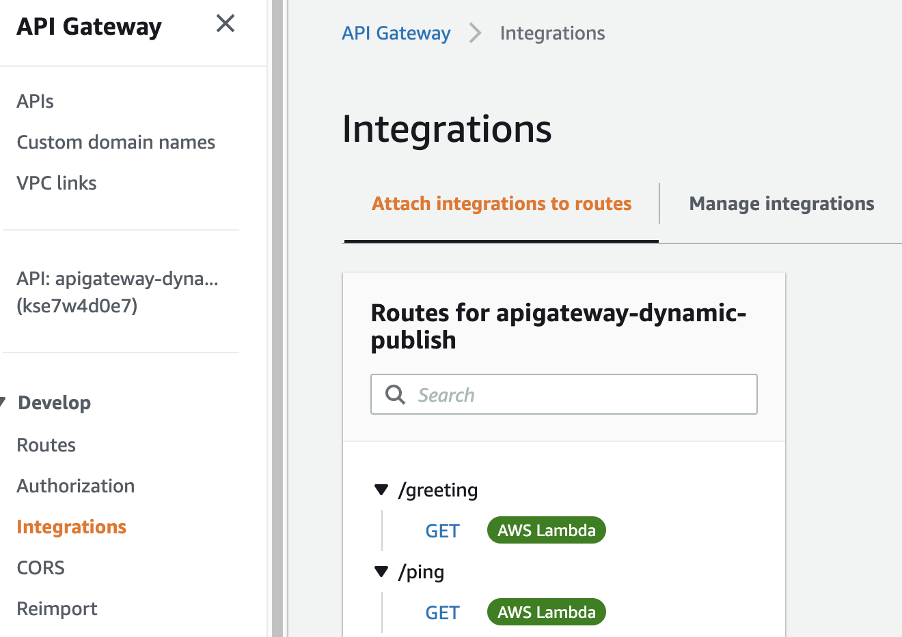

# api-gateway-dynamic-publish

CDK project that leverages an OpenAPI definition to define, document and create an Amazon API Gateway deployment. At deploy time, a [CloudFormation Custom Resource](https://docs.aws.amazon.com/AWSCloudFormation/latest/UserGuide/template-custom-resources.html) is leveraged to dynamically substitute the Lambda integration function ARNs into the OpenAPI definition file as well as publishing the updated file to an S3 bucket for documentation viewing.

----

* [Project overview](#project-overview)
* [Solution overview](#solution-overview)
* [Key points of the solution](#key-points-of-the-solution)
* [Deploying the solution](#deploying-the-solution)
* [Testing the Amazon API Gateway endpoints](#testing-the-amazon-api-gateway-endpoints)
  * [Ping endpoint](#ping-endpoint)
  * [Greeting endpoint](#greeting-endpoint)
* [Viewing the API documentation](#viewing-the-api-documentation)
* [Clean-up the solution](#clean-up-the-solution)
* [Conclusion](#conclusion)
* [Executing unit tests](#executing-unit-tests)

## Project overview

[Amazon API Gateway](https://aws.amazon.com/api-gateway/) is a fully managed service that makes it easy for developers to create, publish, maintain, monitor, and secure APIs at any scale. APIs act as the "front door" for applications to access data, business logic, or functionality from your backend services. Using API Gateway, you can create RESTful APIs and WebSocket APIs that enable real-time two-way communication applications. API Gateway supports containerized and serverless workloads, as well as web applications.

The [OpenAPI Specification (OAS)](https://swagger.io/specification/) defines a standard, language-agnostic interface to RESTful APIs which allows both humans and computers to discover and understand the capabilities of the service without access to source code, documentation, or through network traffic inspection. When properly defined, a consumer can understand and interact with the remote service with a minimal amount of implementation logic. An OpenAPI definition can then be used by documentation generation tools to display the API.

This blog post will describe how an OpenAPI definition can be used to define, document and create an Amazon API Gateway deployment from a single definition file. At deploy time, a [CloudFormation Custom Resource](https://docs.aws.amazon.com/AWSCloudFormation/latest/UserGuide/template-custom-resources.html) is leveraged to dynamically substitute the Lambda integration function ARNs into the OpenAPI definition file as well as publishing the updated file to an S3 bucket for documentation viewing.

## Solution overview

The solution architecture discussed in this post is presented below:


1. CDK is used to synthesise a CloudFormation template.
2. The generated CloudFormation template includes the definition of a custom resource. The custom resource is implemented via a Lambda function which will dynamically substitute the function ARNs of the Amazon API Gateway Lambda integrations into the OpenAPI definition file.
3. Once the custom resource has completed the substitution processes, the resulting OpenAPI definition file is used to create the Amazon API Gateway. The same OpenAPI definition file is then published to an S3 bucket to allow for documentation viewing.
4. Upon successful deployment of the CloudFormation stack, end users can invoke the Amazon API Gateway. They can also view the API documentation via the [Swagger UI](https://swagger.io/tools/swagger-ui/).

## Key points of the solution

The relevant section of the CDK [stacks/apigateway_dynamic_publish.py](stacks/apigateway_dynamic_publish.py) stack, in which the Custom Resource and Lambda are defined, is shown below:

```python
# Create a role for the api creator lambda function
apicreator_lambda_role = iam.Role(
    scope=self,
    id="ApiCreatorLambdaRole",
    assumed_by=iam.ServicePrincipal("lambda.amazonaws.com"),
    managed_policies=[
        iam.ManagedPolicy.from_aws_managed_policy_name(
            "service-role/AWSLambdaBasicExecutionRole"
        )
    ]
)
apicreator_lambda_role.add_to_policy(
    iam.PolicyStatement(
        effect=iam.Effect.ALLOW,
        resources=[
            "arn:aws:apigateway:*::/apis/*",
            "arn:aws:apigateway:*::/apis"
        ],
        actions=[
            "apigateway:DELETE",
            "apigateway:PUT",
            "apigateway:PATCH",
            "apigateway:POST",
            "apigateway:GET"
        ]
    )
)
apicreator_lambda_role.add_to_policy(
    iam.PolicyStatement(
        effect=iam.Effect.ALLOW,
        resources=["*"],
        actions=[
            "logs:*"
        ]
    )
)
api_documentation_bucket.grant_read_write(apicreator_lambda_role)
apicreator_lambda = aws_lambda.Function(
    scope=self,
    id="ApiCreatorLambda",
    code=aws_lambda.Code.from_asset( 
        f"{os.path.dirname(__file__)}/resources/api_creation",
        bundling=BundlingOptions(
            image=aws_lambda.Runtime.PYTHON_3_9.bundling_image,
            command=[
                "bash", "-c",
                "pip install --no-cache -r requirements.txt -t /asset-output && cp -au . /asset-output"
            ],
        ),
    ),
    handler="api_creator.lambda_handler",
    role=apicreator_lambda_role,
    runtime=aws_lambda.Runtime.PYTHON_3_9,
    timeout=Duration.minutes(5)
)
# Provider that invokes the api creator lambda function
apicreator_provider = custom_resources.Provider(
    self,
    'ApiCreatorCustomResourceProvider',
    on_event_handler=apicreator_lambda
)
# The custom resource that uses the api creator provider to supply values
apicreator_custom_resource = CustomResource(
    self,
    'ApiCreatorCustomResource',
    service_token=apicreator_provider.service_token,
    properties={
        'ApiGatewayAccessLogsLogGroupArn': api_gateway_access_log_group.log_group_arn,
        'ApiIntegrationPingLambda': api_gateway_ping_lambda.function_arn,
        'ApiIntegrationGreetingLambda': api_gateway_greeting_lambda.function_arn,
        'ApiDocumentationBucketName': api_documentation_bucket.bucket_name,
        'ApiDocumentationBucketUrl': api_documentation_bucket.bucket_website_url,
        'ApiName': f"{config['api']['apiName']}",
        'ApiStageName': config['api']['apiStageName'],
        'ThrottlingBurstLimit': config['api']['throttlingBurstLimit'],
        'ThrottlingRateLimit': config['api']['throttlingRateLimit']
    }
))

apigateway_id = CustomResource.get_att_string(apicreator_custom_resource, attribute_name='ApiId')
apigateway_endpoint = CustomResource.get_att_string(apicreator_custom_resource, attribute_name='ApiEndpoint')
apigateway_stagename = CustomResource.get_att_string(apicreator_custom_resource, attribute_name='ApiStageName')
```

-----

The [stacks/resources/api_creation/api_creator.py](stacks/resources/api_creation/api_creator.py) Lambda function, called by the Custom Resource, is shown below:

```python
import boto3
import json
import logging
import os
import yaml

# set logging
logger = logging.getLogger()
logger.setLevel(logging.DEBUG)

# environment variables
aws_region = os.environ['AWS_REGION']

# boto3 clients
apigateway_client = boto3.client('apigatewayv2')
s3_client = boto3.client('s3')

def replace_placeholders(template_file: str, substitutions: dict) -> str:
    import re

    def from_dict(dct):
        def lookup(match):
            key = match.group(1)
            return dct.get(key, f'<{key} not found>')
        return lookup

    with open (template_file, "r") as template_file:
        template_data = template_file.read()

    # perform the subsitutions, looking for placeholders @@PLACEHOLDER@@
    api_template = re.sub('@@(.*?)@@', from_dict(substitutions), template_data)

    return api_template


def get_api_by_name(api_name: str) -> str:
    get_apis = apigateway_client.get_apis()
    for api in get_apis['Items']:
        if api['Name'] == api_name:
            return api['ApiId']

    return None


def create_api(api_template:str):
    api_response = apigateway_client.import_api(
        Body=api_template,
        FailOnWarnings=True
    )

    return api_response['ApiEndpoint'], api_response['ApiId']


def update_api(api_template: str, api_name:str):
    
    api_id = get_api_by_name(api_name)

    if api_id is not None:
        api_response = apigateway_client.reimport_api(
            ApiId=api_id,
            Body=api_template,
            FailOnWarnings=True
        )
        return api_response['ApiEndpoint'], api_response['ApiId']


def delete_api(api_name: str):
    if get_api_by_name(api_name) is not None:
        response = apigateway_client.delete_api(
            ApiId=get_api_by_name(api_name)
        )


def deploy_api(
        api_id: str, 
        api_stage_name: str,
        api_access_logs_arn: str,
        throttling_burst_limit: int, 
        throttling_rate_limit: int
    ):
    apigateway_client.create_stage(
        AccessLogSettings={
            'DestinationArn': api_access_logs_arn,
            'Format': '$context.identity.sourceIp - - [$context.requestTime] "$context.httpMethod $context.routeKey $context.protocol" $context.status $context.responseLength $context.requestId $context.integrationErrorMessage'
        },
        ApiId=api_id,
        StageName=api_stage_name,
        AutoDeploy=True,
        DefaultRouteSettings={
            'DetailedMetricsEnabled': True,
            'ThrottlingBurstLimit':throttling_burst_limit,
            'ThrottlingRateLimit': throttling_rate_limit
        }
    )


def delete_api_deployment(api_id: str, api_stage_name: str):
    try:
        apigateway_client.get_stage(
            ApiId=api_id,
            StageName=api_stage_name
        )

        apigateway_client.delete_stage(
            ApiId=api_id,
            StageName=api_stage_name
        )
    except apigateway_client.exceptions.NotFoundException as e:
        logger.error(f"Stage name: {api_stage_name} for api id: {api_id} was not found during stage deletion. This is an expected error condition and is handled in code.")
    except Exception as e:
        raise ValueError(f"Unexpected error encountered during api deployment deletion: {str(e)}")


def publish_api_documentation(bucket_name, api_definition):

    api_definition_json=json.dumps(yaml.safe_load(api_definition))    

    with open("/tmp/swagger.json", "w") as swagger_file:
        swagger_file.write(api_definition_json)

    # Upload the file
    try:

        s3_client.upload_file("/tmp/swagger.json", bucket_name, "swagger.json")

    except Exception as e:
        logging.error(str(e))
        raise ValueError(str(e))


def lambda_handler(event, context):
    
    # print the event details
    logger.debug(json.dumps(event, indent=2))

    props = event['ResourceProperties']
    api_gateway_access_log_group_arn = props['ApiGatewayAccessLogsLogGroupArn']
    api_integration_ping_lambda = props['ApiIntegrationPingLambda']
    api_integration_greetings_lambda = props['ApiIntegrationGreetingLambda']
    api_name = props['ApiName']
    api_stage_name = props['ApiStageName']
    api_documentation_bucket_name = props['ApiDocumentationBucketName']
    throttling_burst_limit = int(props['ThrottlingBurstLimit'])
    throttling_rate_limit = int(props['ThrottlingRateLimit'])

    lambda_substitutions = {
        "API_NAME": api_name,
        "API_INTEGRATION_PING_LAMBDA": f"arn:aws:apigateway:{aws_region}:lambda:path/2015-03-31/functions/{api_integration_ping_lambda}/invocations",
        "API_INTEGRATION_GREETING_LAMBDA": f"arn:aws:apigateway:{aws_region}:lambda:path/2015-03-31/functions/{api_integration_greetings_lambda}/invocations"
    }

    api_template = replace_placeholders("api_definition.yaml", lambda_substitutions)

    if event['RequestType'] != 'Delete':

        if get_api_by_name(api_name) is None:

            logger.debug("Creating API")

            api_endpoint, api_id = create_api(api_template)

            deploy_api(api_id, api_stage_name, api_gateway_access_log_group_arn, throttling_burst_limit, throttling_rate_limit)

            publish_api_documentation(api_documentation_bucket_name, api_template)

            output = {
                'PhysicalResourceId': f"generated-api",
                'Data': {
                    'ApiEndpoint': api_endpoint,
                    'ApiId': api_id,
                    'ApiStageName': api_stage_name
                }
            }
            
            return output

        else:

            logger.debug("Updating API")

            api_endpoint, api_id = update_api(api_template, api_name)

            # delete and redeploy the stage after updating the api definition
            delete_api_deployment(api_id, api_stage_name)
            deploy_api(api_id, api_stage_name, api_gateway_access_log_group_arn, throttling_burst_limit, throttling_rate_limit)

            publish_api_documentation(api_documentation_bucket_name, api_template)

            output = {
                'PhysicalResourceId': f"generated-api",
                'Data': {
                    'ApiEndpoint': api_endpoint,
                    'ApiId': api_id,
                    'ApiStageName': api_stage_name
                }
            }
        
        return output

    if event['RequestType'] == 'Delete':

        logger.debug("Deleting API")

        if get_api_by_name(api_name) is not None:
            delete_api(api_name)

        output = {
            'PhysicalResourceId': f"generated-api",
            'Data': {
                'ApiEndpoint': "Deleted",
                'ApiId': "Deleted",
                'ApiStageName': "Deleted"
            }
        }
        logger.info(output)
        
        return output
```

-----

The OpenAPI definition file, [stacks/resources/api_creation/api_definition.yaml](stacks/resources/api_creation/api_definition.yaml), is shown below. Note the presence of the dynamic variables represented as `@@VARIABLE_NAME@@` which will be replaced by the custom resource.

```yaml
openapi: "3.0.0"
info:
  title: @@API_NAME@@
  version: "v1.0"
x-amazon-apigateway-request-validators:
  all:
    validateRequestBody: true
    validateRequestParameters: true
  params-only:
    validateRequestBody: false
    validateRequestParameters: true
x-amazon-apigateway-request-validator: all
paths:
  /ping:
    get:
      summary: "Simulates an API Ping"
      description: |
        ## Simulates an API Ping

        The purpose of this endpoint is to simulate a Ping request and respond with a Pong answer.
      operationId: "pingIntegration"
      x-amazon-apigateway-request-validator: all
      responses:
        200:
          description: "OK"
          content: 
            application/json:
              schema:
                type: array
                items:
                  $ref: "#/components/schemas/PingResponse"
        500:
          description: "Internal Server Error"
      x-amazon-apigateway-integration:
        uri: @@API_INTEGRATION_PING_LAMBDA@@
        payloadFormatVersion: "2.0"
        httpMethod: "POST"
        type: "aws_proxy"
        connectionType: "INTERNET"
  /greeting:
    get:
      summary: "Get a greeting message"
      description: |
        ## Get a greeting message

        The purpose of this endpoint is send a greeting string and receive a greeting message.
      operationId: "greetingIntegration"
      x-amazon-apigateway-request-validator: all
      parameters:
      - in: query
        name: greeting
        schema:
          type: string
        description: |
            A greeting string which the API will combine to form a greeting message
      responses:
        200:
          description: "OK"
          content: 
            application/json:
              schema:
                type: array
                items:
                  $ref: "#/components/schemas/GreetingResponse"
        500:
          description: "Internal Server Error"
      x-amazon-apigateway-integration:
        uri: @@API_INTEGRATION_GREETING_LAMBDA@@
        payloadFormatVersion: "2.0"
        httpMethod: "POST"
        type: "aws_proxy"
        connectionType: "INTERNET"
components:
  schemas:
    PingResponse:
      type: object
      properties:
        ping:
          type: string
          description: |
            Response to the ping request.
    GreetingResponse:
      type: object
      properties:
        greeting:
          type: string
          description: |
            The greeting response which concatenates the incoming greeting to form a greeting message.
```

## Deploying the solution

The solution code uses the Python flavour of the AWS CDK ([Cloud Development Kit](https://aws.amazon.com/cdk/)). In order to execute the solution code, please ensure that you have fulfilled the [AWS CDK Prerequisites for Python](https://docs.aws.amazon.com/cdk/latest/guide/work-with-cdk-python.html).

The solution code requires that the AWS account is [bootstrapped](https://docs.aws.amazon.com/de_de/cdk/latest/guide/bootstrapping.html) in order to allow the deployment of the solution’s CDK stack.

```bash
# navigate to project directory
cd api-gateway-dynamic-publish

# install and activate a Python Virtual Environment
python3 -m venv .venv
source .venv/bin/activate

# install dependant libraries
python -m pip install -r requirements.txt

# bootstrap the account to permit CDK deployments
cdk bootstrap
```

Upon successful completion of `cdk bootstrap`, the solution is ready to be deployed.

The CDK stack can be deployed with the command below.

```bash
cdk deploy
```


Following a successful deployment, verify that two new stacks have been created.

* `CDKToolkit`
* `ApiGatewayDynamicPublish`

Log into the AWS Console → navigate to the CloudFormation console:
[Image: cdk-stacks-screenshot.png]Verify the successful deployment of the Amazon API Gateway.

1. Log into the AWS Console → navigate to the API Gateway console.
2. Click on the API with name `apigateway-dynamic-publish` to open the detailed API view.
3. Click on `Develop` → `Integrations` and verify the `/greeting` and `/ping` routes.



The CDK stack has successfully deployed the Amazon API Gateway according to the specifications described in the OpenAPI definition file, [stacks/resources/api_creation/api_definition.yaml](stacks/resources/api_creation/api_definition.yaml).

## Testing the Amazon API Gateway endpoints

The project includes 2 test scripts that can be executed to test the `/ping` and `/greeting` API endpoints respectively.

### Ping endpoint

Test the `/ping` API endpoint with the command below:

```bash
examples/test_ping_api.sh
```

An example of a successful response is shown below:

```bash
Testing GET https://xxxxxxxx.execute-api.xx-xxxx-x.amazonaws.com/dev/ping

{ "ping": "Pong" }
```

### Greeting endpoint

Test the `/greeting` API endpoint with the command below:

```bash
examples/test_greeting_api.sh
```

An example of a successful response is shown below:

```bash
Testing GET https://xxxxxxxx.execute-api.xx-xxxx-x.amazonaws.com/dev/greeting?greeting=world

{ "greeting": "Hello world" }
```

## Viewing the API documentation

During the project deployment, the OpenAPI definition file [stacks/resources/api_creation/api_definition.yaml](stacks/resources/api_creation/api_definition.yaml), is uploaded to an S3 bucket where it can be consumed to visualise the API documentation via [Swagger UI](https://github.com/swagger-api/swagger-ui).

To view API documentation in the OpenAPI format, it is necessary to download Swagger UI which is a third party, open source project licenced under the Apache License 2.0.

More information about Swagger UI can be found on the project's GitHub page; https://github.com/swagger-api/swagger-ui.

The command below can be used to launch the API documentation viewer. The command will ask you for permission to download Swagger UI.

```bash
apidocs/view_api_docs.sh
```

The command starts a [Node.js](https://nodejs.org/en/) server listening at [http://localhost:12345](http://localhost:12345/)

Open [http://localhost:12345](http://localhost:12345/) in your preferred browser to view the API documentation.


## Clean-up the solution

Solution clean-up is a 2 step process:

1. Destroy the CDK stack.
2. Delete the *CDKToolkit* stack from CloudFormation.

Delete the stack deployed by CDK with the command below:

```bash
cdk destroy
```


Delete the CDKToolkit CloudFormation stack.

1. Log into the AWS Console → navigate to the *CloudFormation* console.
2. Navigate to *Stacks*.
3. Select the **CDKToolkit**.
4. Click the *Delete* button.

## Conclusion

In this blog post we have a seen how an OpenAPI definition file can be leveraged to define, document and create an Amazon API Gateway.

A challenge that arises when defining, documenting and creating an Amazon API Gateway via an Infrastructure as Code approach is that the function ARNs of the Amazon API Gateway Lambda integrations must be added to the OpenAPI definition file prior to API Gateway creation. The function ARNs are not generated until deploy time.

This solution provides a  [CloudFormation Custom Resource](https://docs.aws.amazon.com/AWSCloudFormation/latest/UserGuide/template-custom-resources.html) which overcomes this challenge by dynamically substituting the Lambda integration function ARNs into the OpenAPI definition file allowing for the creation of the Amazon API Gateway and the publishing of the API documentation to an S3 bucket.

This blog post focuses on an Amazon API Gateway specific use case, however the Custom Resource pattern is very flexible and can be used to extend and enhance the functionality of CloudFormation templates and CDK stacks across a variety of use case scenarios.

# Executing unit tests

Unit tests for the project can be executed via the command below:

```bash
python3 -m venv .venv
source .venv/bin/activate
cdk synth && python -m pytest
```

# Security

See [CONTRIBUTING](CONTRIBUTING.md#security-issue-notifications) for more information.

# License

This library is licensed under the MIT-0 License. See the LICENSE file.